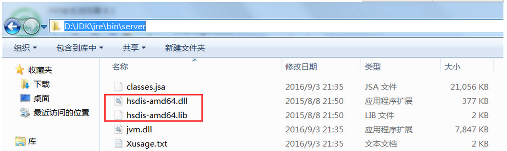

# 如何实现Java代码生成汇编指令

## hsdis-1.1.1-win32-amd64.zip

1. 当前文件夹下有一个hsdis-1.1.1-win32-amd64.zip文件，通过解压以后，里面会有两个文件，一个是hsdis-amd64.dll，一个是hsdis-amd64.lib
2. 参考如下图所示，把这两个文件放到${JAVA_HOME}\jre\bin\server 下




## IntelliJ IDEA开发工具下，配置生成汇编指令

- 在IntelliJ IDEA中编写一个main方法

```java
public class App {
    private static volatile App instance = null;

    public static App getInstance() {
        return instance == null ? new App() : instance;
    }

    public static void main(String[] args) {
        App.getInstance();
    }
}
```

- 配置run  configration 增加jvm运行参数


```java
-server -Xcomp -XX:+UnlockDiagnosticVMOptions -XX:+PrintAssembly -XX:CompileCommand=compileonly,*App.getInstance（替换成实际运行的代码）
```

`		App.getInstance`替换成你实际编写的类的名称和方法。

- 右键直接运行，即可看到输出的汇编指令